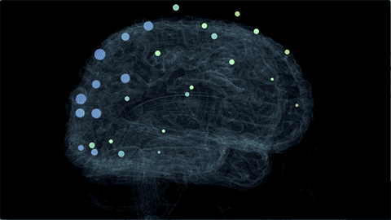

  

### Hi there! My name is Rhys Switzer, and I often go by NotMyMajor.
I am a full-time neuroscience research assistant at Baylor University. I mostly use MATLAB at work, but I occasionally use Python for fun!

## Links
https://www.linkedin.com/in/rhys-switzer-6811851a6

https://www.instagram.com/rhys_switzer/

## My Interests:
* MATLAB
* Python
* Blender
* Arduino
* EEG
* BCI Technology
* Neuroscience
* Psychology
* Machine Learning
* AI

## Looking For
Nothing at the moment! (Happily employed.)

## Contact Info
rhys.switzer@alumni.ou.edu

<!---
NotMyMajor/NotMyMajor is a ✨ special ✨ repository because its `README.md` (this file) appears on your GitHub profile.
You can click the Preview link to take a look at your changes.
--->

  

